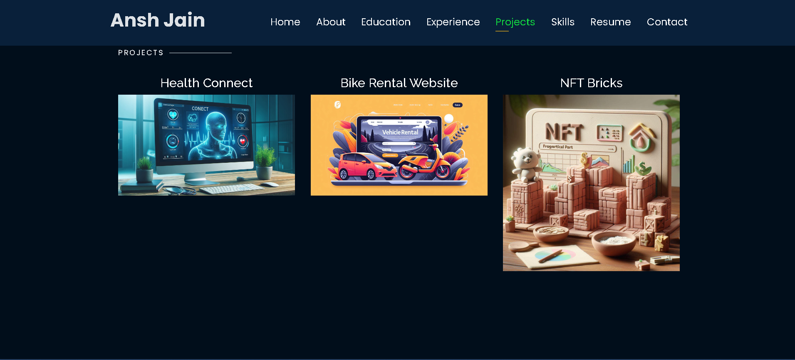

# Personal Portfolio 🔥
> https://tushartak17.github.io/Portfolio/

:star: Star me on GitHub — it helps!

### Website Preview
#### Home Page

#### About Page

#### Projects Page

  
# Tushar Tak's Portfolio

Welcome to my personal portfolio! You can view my portfolio live at [Tushar Tak's Portfolio](https://tushartak17.github.io/Portfolio/).

## About Me ℹ️
Dynamic and results-oriented B.Tech student from Swami Keshvanand Institute of Technology, Management & Gramothan (SKIT) Jaipur, specializing in software development. Proficient in programming languages such as C, C++, and Java, with a keen interest in leveraging technology to drive innovation. Seeking to apply internship experiences to contribute effectively to dynamic projects within a progressive organization.

## Projects 🚀
### Hospital Management System
- Contributed as a collaborative team member in developing a robust hospital management system.
- Employed JavaScript for backend development and HTML/CSS for frontend, utilizing Visual Studio Code as the integrated development environment.
- Spearheaded backend development, ensuring seamless data management and API integration for enhanced functionality.

### Phone Directory
- Designed and developed a phone directory app using advanced Data Structures and Algorithms, emphasizing linked lists.
- Features include contact list display, addition, editing, deletion, and sorting.
- Leveraged C language extensively, honing skills in C programming, Data Structures, and algorithmic problem-solving.

## Education 🎓
- Bachelor of Technology | 2022-2026
  Pursuing B.Tech in Computer Science at Swami Keshvanand Institute of Technology, Management & Gramothan (SKIT), Jaipur, Rajasthan

- XII Rajasthan Board of Secondary Education (RBSE) | 2021-2022
  The Castle Convent Sr. Secondary School, Jaipur, Rajasthan

## Experiences 💼
- **Hackathon and Ideathon Participation**
  - Actively engaged in Hackathons and Ideathons across prestigious institutions including IIT Jodhpur, JECRC University Jaipur, and Vivekanand Global University.
  - Achieved notable success at JECRC University's hackathon, securing the 9th position out of 80+ teams with the Hospital Management System project.
  - Demonstrated adept problem-solving and teamwork skills.

- **Volunteering, Coordination, and Leadership Experience**
  - Demonstrated leadership and coordination prowess through active involvement as a CodeFiesta Club member and volunteer coordinator.
  - Leveraged leadership skills in organizing major cultural events like Clash Of Bands, fostering a collaborative environment conducive to team success.

## Skills 💻
- Programming Languages: Proficient in C, C++, and Java, with demonstrated expertise in crafting efficient and scalable solutions.
- Data Structures & Algorithms: Demonstrated competence in enhancing computational efficiency and problem-solving capabilities.
- AI Fundamentals: Completed Generative AI Fundamentals program at Google and Intermediate Problem Solving certification at HackerRank.

## Contact 📧
- 📧 Email: jansh7784@gmail.com
- 🌐 LinkedIn: [Ansh Jain's LinkedIn](https://www.linkedin.com/in/ansh--jain/)

## License

- **[MIT license](http://opensource.org/licenses/mit-license.php)**
